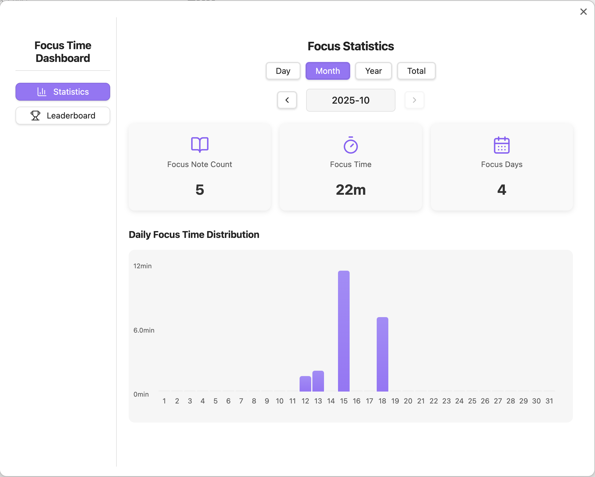

# Focus Time Plugin

English | [简体中文](README_zh.md)

The Focus Time Plugin automatically tracks the time you spend focused on your notes and provides comprehensive data analytics. With this tool, you can better review your focus journey, uncover "hidden gem notes" marked by time, and make your Obsidian note-taking more planned and rewarding!

If you find this plugin useful, you can support me on [Afdian](https://afdian.com/a/astradev). Your encouragement is the driving force behind my continued development.

## Features Overview

- **Track Focus Time**: Automatically tracks the time spent focusing on each note (also supports tracking reading time for PDF files).
- **Smart Data Analytics**: Brand new Dashboard interface with day/month/year/total view focus time analysis.
- **Interactive Charts**: Intuitive bar charts with drill-down navigation (total→year→month→day).
- **Focus Time Leaderboard**: View the top 10 notes ranked by total focus time.
- **Responsive Design**: Perfect adaptation for desktop and mobile with consistent user experience.
- **Theme Support**: Adapts seamlessly to both light and dark modes.

## Key Features

### 📊 Data Analytics Dashboard
- **Multi-dimensional Views**: Support for day, month, year, and total time dimension analysis
- **Smart Date Navigation**: Quick time range switching with date, month, and year navigation
- **Key Metrics Display**: Focus note count, focus time, and focus days at a glance
- **Interactive Charts**: Click charts to drill down to more detailed time dimensions

### 📈 Visualization Charts
- **Monthly View**: Display daily focus time distribution
- **Yearly View**: Show monthly focus time trends
- **Total View**: Display focus time changes over the last 10 years
- **Dynamic Units**: Automatically select hours or minutes display based on data size

### 📱 Responsive Interface
- **Desktop**: Left-right sidebar layout with fixed sidebar display
- **Mobile**: Collapsible sidebar with gesture support

## Installation Instructions

Follow these steps to install the plugin:

1. In Obsidian, navigate to **Settings** → **Community Plugins** → **Search for "Focus Time"** → **Install the plugin**.
2. Enable the plugin under the **Community Plugins** settings.

## User Guide

### Track Focus Time

Every time you open a note, the plugin automatically starts tracking your focus time, which is displayed in the status bar at the bottom right. When you switch notes or minimize Obsidian, the plugin stops tracking and saves the data (you can disable window detection in the plugin settings by turning off focus mode).

### View the Data Analytics Dashboard

To view your focus time data analytics:

1. Click the Dashboard button in the left sidebar.

   

2. The Dashboard will display your focus time analytics data, including:
   - **Reading Data**: Day/month/year/total view focus time statistics
   - **Leaderboard**: Top 10 notes ranked by focus time

   

### Using Data Analytics Features

- **Switch Views**: Select "Reading Data" or "Leaderboard" in the left sidebar
- **Time Navigation**: Use the date navigator at the top to switch between different time ranges
- **Chart Interaction**: Click on bar charts to drill down to more detailed time dimensions
- **Note Navigation**: Click on focus note list items to directly open corresponding notes

## Contributing

Feel free to fork this project, report issues, or submit pull requests to improve and fix the plugin.

## License

This plugin is open source and licensed under the [Apache 2.0 License](LICENSE).
