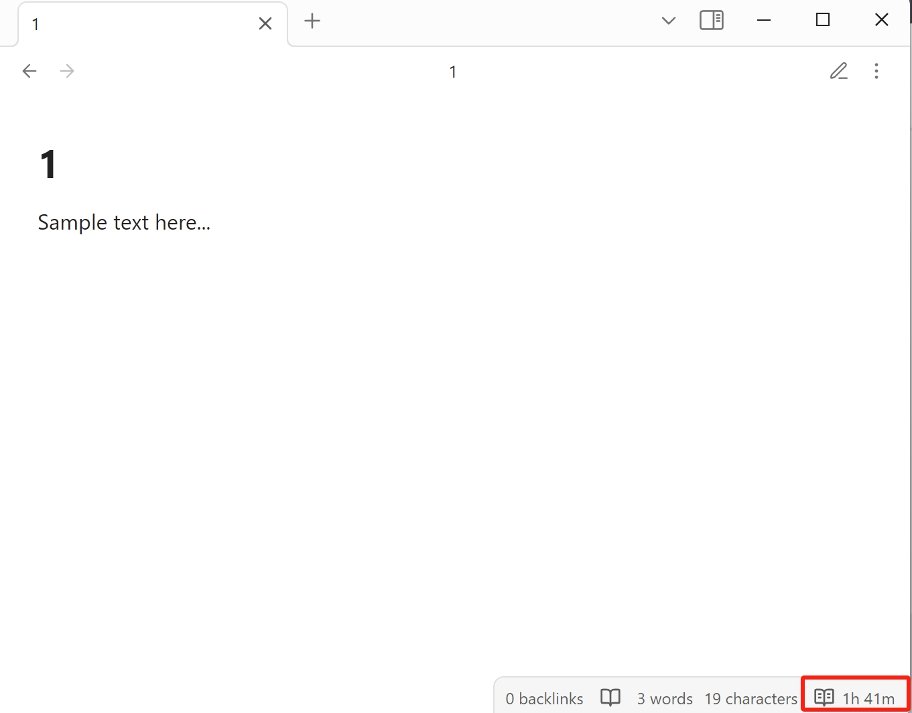
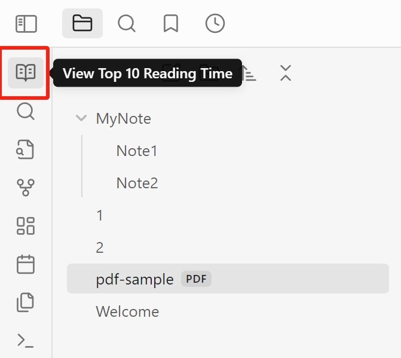
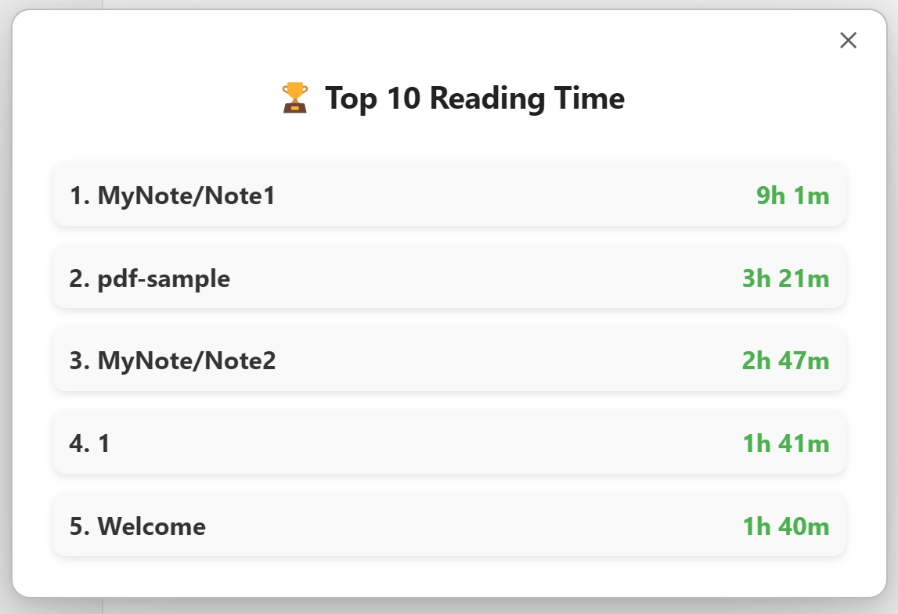

# 专注时间插件

[English](README.md) | 简体中文

专注时间插件能够自动记录你的笔记专注时长，并支持查看每篇笔记总专注时长数据。有了它，你能更好地回顾自己的专注历程，发现那些被时光见证的 “宝藏笔记”，让你的 Obsidian 笔记时光更有规划、更具成就感！

## 功能概述

- **记录专注时长**：自动记录你在每篇笔记上的专注时长（也可以记录PDF书籍的阅读时长哦）。
- **专注时长排行榜**：可查看专注时间排名前十的笔记。
- **主题支持**：支持日间模式和夜间模式，自动适应 UI 样式。
- **国际化支持**：目前支持**简体中文**和**English**。

## 规划中功能

- 每日专注时长记录，生成每日报表
- 日、周、月、年专注时长分析

## 安装说明

安装此插件的步骤：

1. 在 Obsidian 中，打开 **设置** → **第三方插件** → **搜索 Focus Time** → **安装插件**。
2. 在 **第三方插件** 设置中启用插件。

## 使用指南

### 记录专注时长

每当你打开一篇笔记时，插件会开始自动记录你的专注时长，并显示在右下角的状态栏上。当你切换笔记或者将 Obsidian 最小化时，插件会停止记录并保存数据（可在插件设置中关闭专注模式来禁用窗口检测）。

### 查看排行榜

要查看你的笔记专注时长排行榜：

1. 点击左侧边栏的排行榜的按钮

   

2. 排行榜将展示你所有笔记的专注时长数据

   

## 贡献

欢迎 Fork 本项目，并提交问题报告或拉取请求进行改进和修复。

## 许可协议

本插件完全开源，遵循 [Apache 2.0 许可证](LICENSE)。

